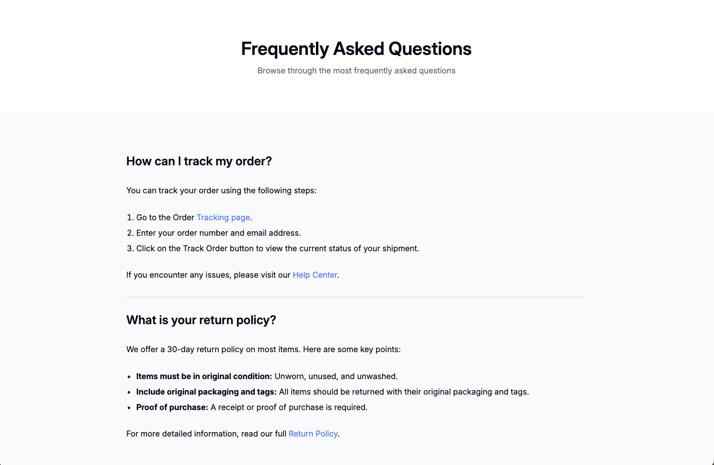

<!-- Please update value in the {}  -->

<h1 align="center">Simple FAQ | devChallenges</h1>

   Solution for a challenge <a href="https://devchallenges.io/challenge/simple-faq-challenge" target="_blank">Simple FAQ</a> from <a href="http://devchallenges.io" target="_blank">devChallenges.io</a>.

  <h3>
    <a href="{https://your-demo-link.your-domain}">
      Demo
    </a>
     | 
    <a href="{https://your-url-to-the-solution}">
      Solution
    </a>
     | 
    <a href="https://devchallenges.io/challenge/simple-faq-challenge">
      Challenge
    </a>
  </h3>

<!-- TABLE OF CONTENTS -->

## Table of Contents

- [Table of Contents](#table-of-contents)
- [Overview](#overview)
  - [What I learned](#what-i-learned)
  - [Built with](#built-with)
- [Features](#features)
- [Author](#author)

<!-- OVERVIEW -->

## Overview

This project is a responsive FAQ page built as part of the [DevChallenges](https://devchallenges.io) challenge. The goal was to create a clean and accessible FAQ page that adapts to different screen sizes.

### What I learned

While working on this project, I improved my understanding of:
- **Responsive design**: Using `calc()` and media queries to create layouts that adapt to various screen sizes.
- **Semantic HTML**: Structuring content with proper HTML5 elements for better accessibility.
- **CSS Flexbox**: Aligning and distributing elements efficiently in a container.

### Built with

- Semantic HTML5 markup
- CSS custom properties
- Flexbox
- Media queries

## Features

This application/site includes the following features:

- A responsive FAQ page that adapts to different screen sizes.
- Clean and accessible design.
- Links for navigation to external resources.

## Author

- Website [your-website.com](https://{your-web-site-link})
- GitHub [@your-username](https://{github.com/your-usermame})
